### Об замерах

Правильно и с большой точностью измерить скорость малых фрагментов кода -- довольно сложная задача, требующая много времени. Приведённые измерения не претендуют на это. Они скорее являются чем-то вроде: "А давайте много раз выполним `push` в нашу реализацию стека, в реализацию стека с $O(n)$ дополнительной памятью и в голый `vector`, а затем посмотрим на значения друг относительно друга. Если разрыв будет не большим, то значит всё хорошо, если большим и будет зависимость от количества элементов в стеке, то значит, что-то пошло не так. Повторим аналогичное для `pop` и `back`", то есть основная задача -- это показать независимость скорости выполнения операций относительно количества элементов в стеке.

Я также добавил специальные команды из `google/benchmark`, которые должны предотвратить оптимизацию `push` и других команд. (Но это не точно, поскольку я не специалист в использование этой библиотеки и не исследовал выходной код. Любые улучшения я срадостью почитаю.) 

Генератор для случайных чисел везде MT1997. Распределение -- равномерное с $0$ и $2^B$.

В `./benchmark/benchmark_1` 
```cpp
static void BM_stack_random_push(benchmark::State &state) {
  size_t data_size = state.range(0);
  std::vector<size_t> data;
  data.reserve(data_size);

  auto now = std::chrono::high_resolution_clock::now();
  std::mt19937 generator(now.time_since_epoch().count());
  std::uniform_int_distribution<size_t> distribution(0, IMAX);
  for (size_t i = 0; i < data_size; ++i) {
    data.emplace_back(distribution(generator));
  }

  Stack stack(B, data_size);
  for (auto _ : state) {
    // Этот код замеряем
    for (size_t i = 0; i < data_size; ++i) {
      size_t value = data[i];
      stack.push(value);
      benchmark::DoNotOptimize(value);
      benchmark::ClobberMemory();
    }
  }
}
```
Здесь мы добавляем случайные данные. Очевидно, что если мы сразу добавим большое число, то текущий максимум будет большим, а значит последующие числа уже будут добавляться без вычисления `id` блока, без выполнения преобразования $2\cdot v - m$, а просто будут добавляться, как в обычный вектор.

Поэтому в `./benchmark/benchmark_2` мы уже будем добавлять элементы последовательно от $0$ до значений близких к $2^B-1$ с определённым шагом. 

В `./benchmark/benchmark_3` 
```cpp
static void BM_stack_random_back_pop(benchmark::State &state) {
  size_t data_size = state.range(0);

  auto now = std::chrono::high_resolution_clock::now();
  std::mt19937 generator(now.time_since_epoch().count());
  std::uniform_int_distribution<size_t> distribution(0, IMAX);

  Stack stack(B, data_size);
  for (auto _ : state) {
    state.PauseTiming();
    for (size_t i = 0; i < data_size; ++i) {
      stack.push(distribution(generator));
    }
    state.ResumeTiming();
    // Этот код замеряем
    size_t value_back = 0;
    size_t value_pop = 0;
    for (size_t i = 0; i < data_size; ++i) {
      value_back = stack.back();
      benchmark::DoNotOptimize(value_back);
      value_pop = stack.pop();
      benchmark::DoNotOptimize(value_pop);
      benchmark::ClobberMemory();
    }
  }
}
```
мы сперва генерируем случайные данные, затем заполняем ими стек, а после чего измеряем время вызова двух команд `stack.back();`, который должен вернуть нам истинное значение, которое было добавлено в стек (не преобразованное по формуле, а именно то, что мы указывали в `push`), а также `stack.pop();`. Конечно, для нашего стека получается лишняя работа, так как `value_back = value_pop` и правильней было бы переписать `pop`, чтобы он отвечал лишь за удаление элемента, но ... "ну и ладно ну и пожалуйста". (В оправдание могу сказать лишь то, что и `pop`, и `back` должны работать за $O(1)$, а поэтому относительно `vector` и эталонного стека, с которым мы сравниваем мы должны будем увидеть лишь константное изменение. А поскольку основная цель этих замеров, показать независимость от количества элементов в стеке, то всё не так страшно.)

`./benchmark/benchmark_1` и `./benchmark/benchmark_2` был запущен с `--benchmark_repetitions=25`, а `./benchmark/benchmark_3` с `10`. Для получения результатов на первые два теста ушло $15$ минут реального времени, а для последнего $23$ на процессоре i7-8750H CPU при зафиксированной частоте работы в $3000$ MHz. Полный выход измерений можно найти в `./results`.

#### Наглядные результаты:
Общее время выполнения измерения. Поскольку мы измеряям цикл `for` целиком, то время увеличивается линейно:
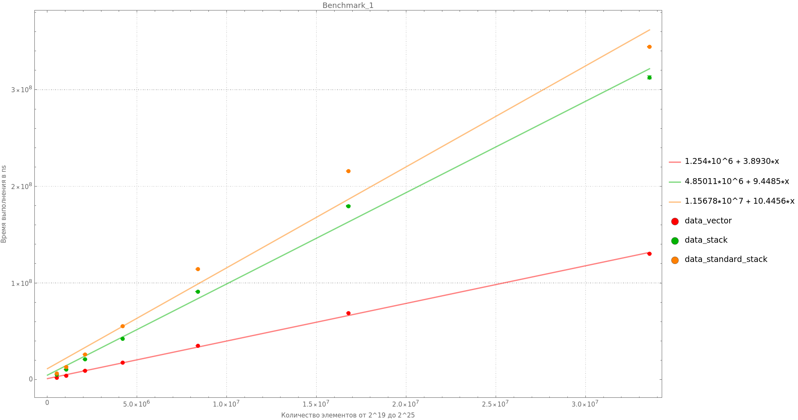
если мы разделим общее время выполнения измерения на количество добавленных элементов, то получим примерное время добавления одного элемента `push`:
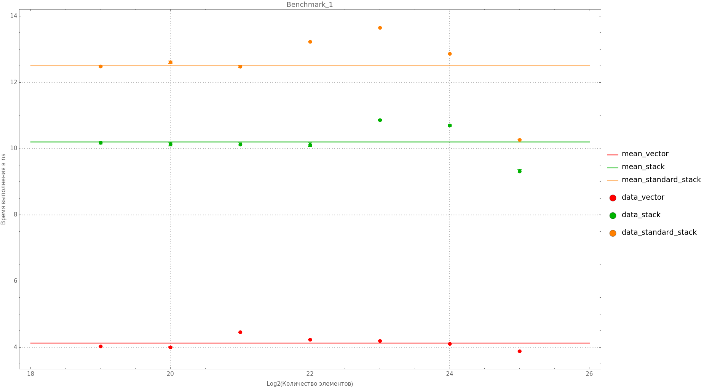

Для каждой структуры: vector, stack, standard_stack (из ./standard_)
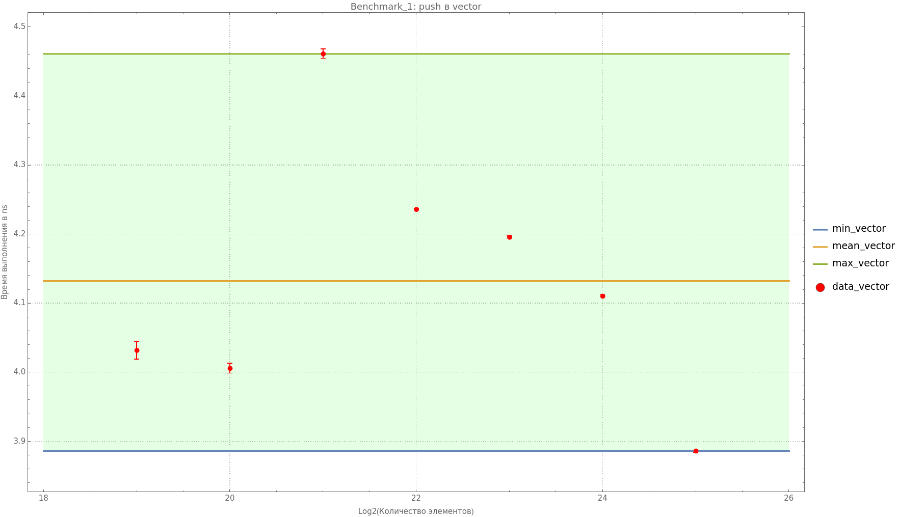
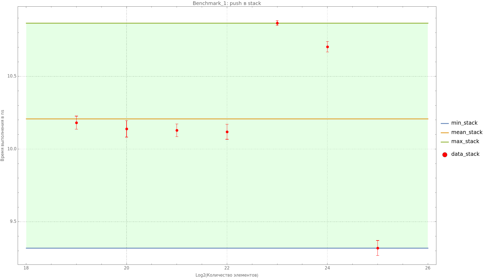
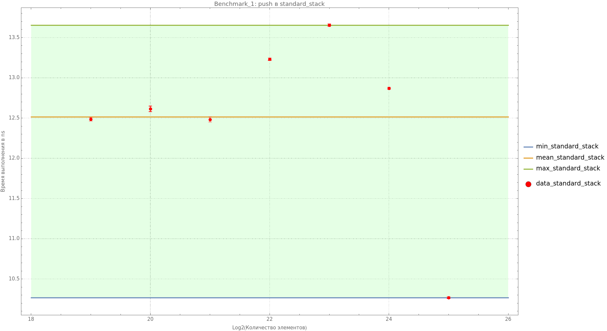

Аналогично для `./benchmark/benchmark_2`:
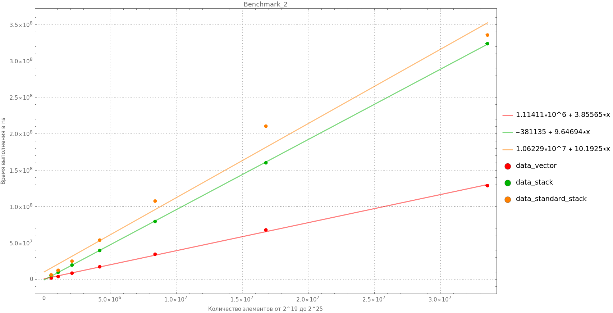 
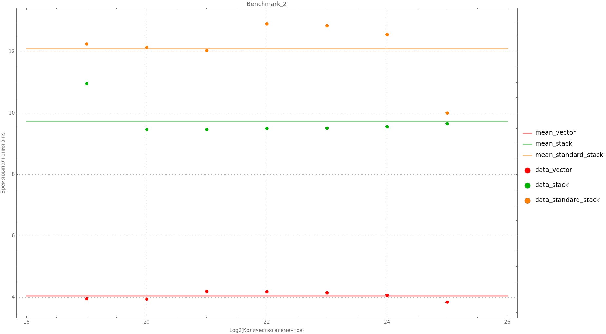 
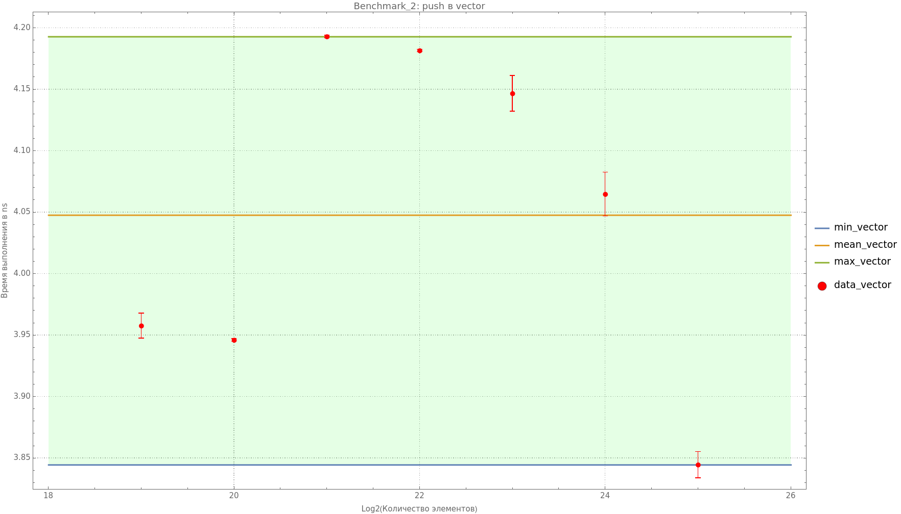 
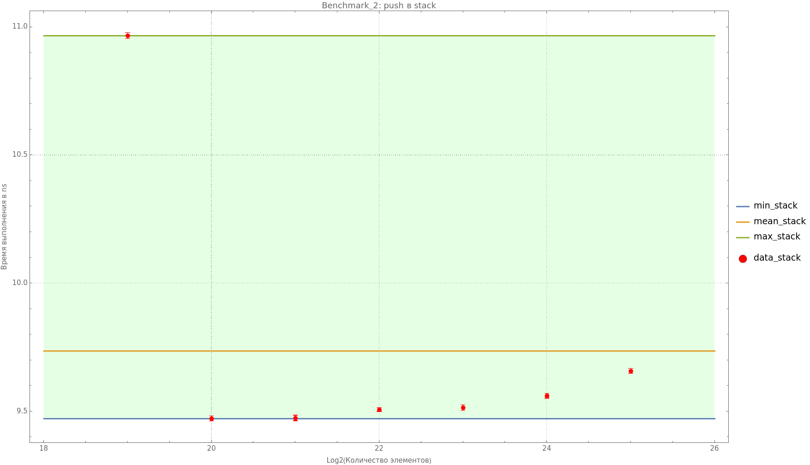 
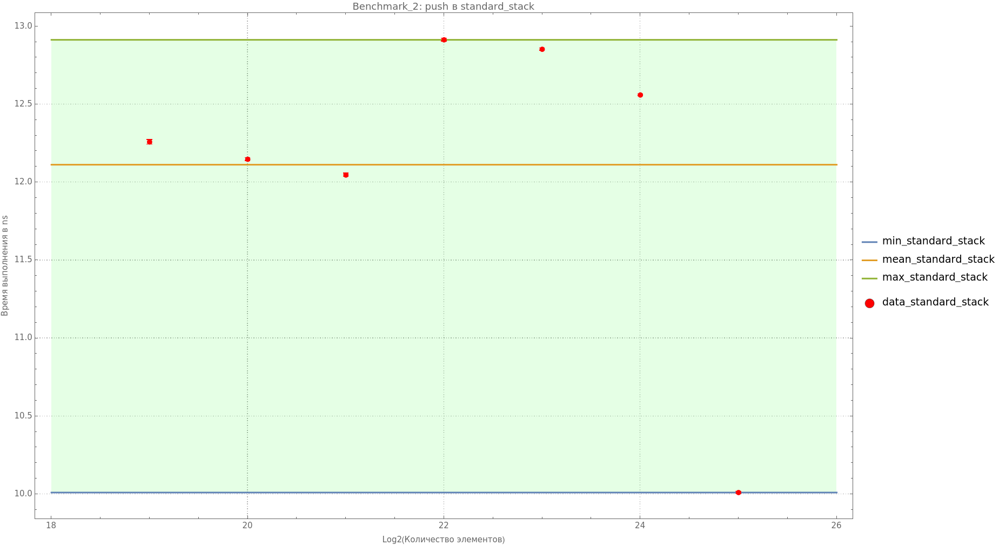

Аналогично для `./benchmark/benchmark_3`:

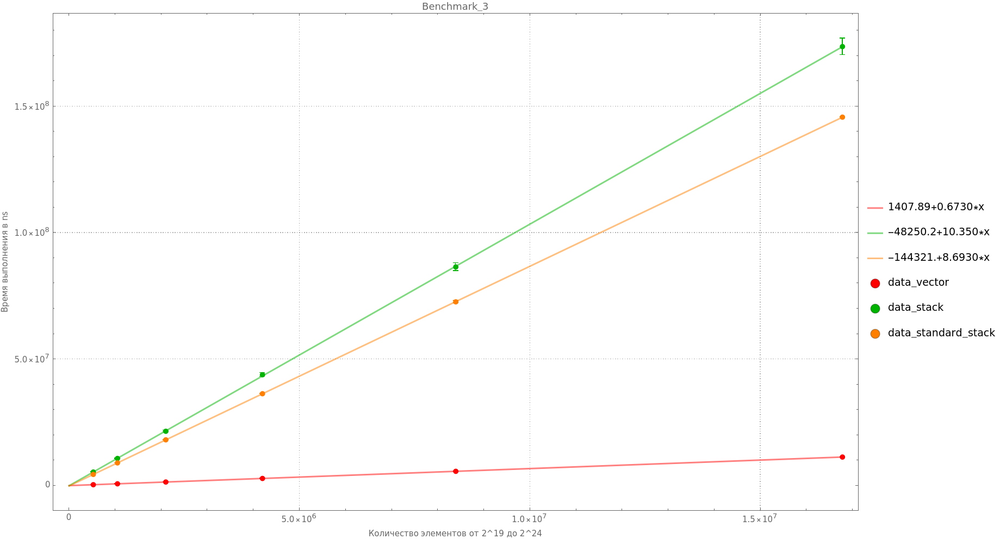 
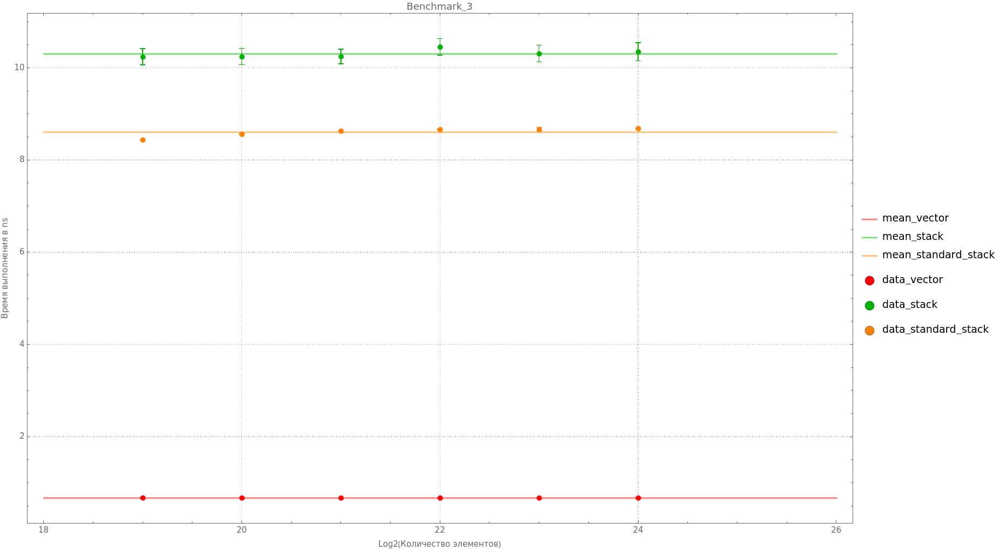 
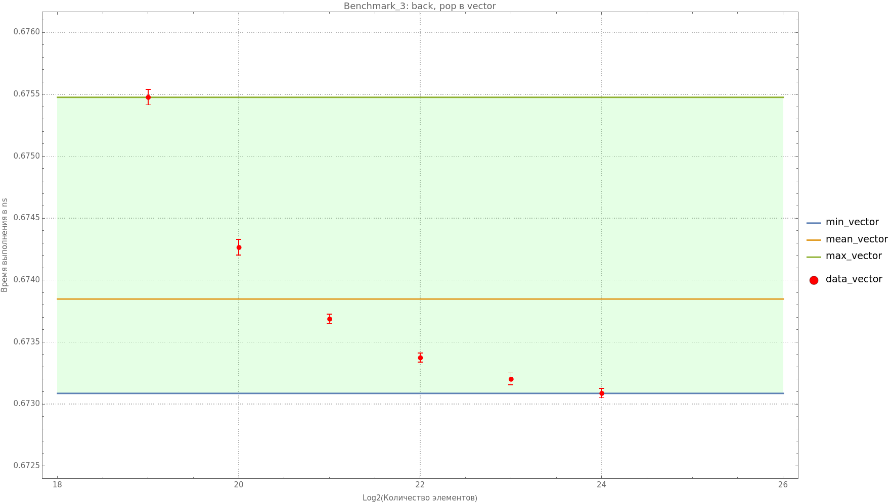 
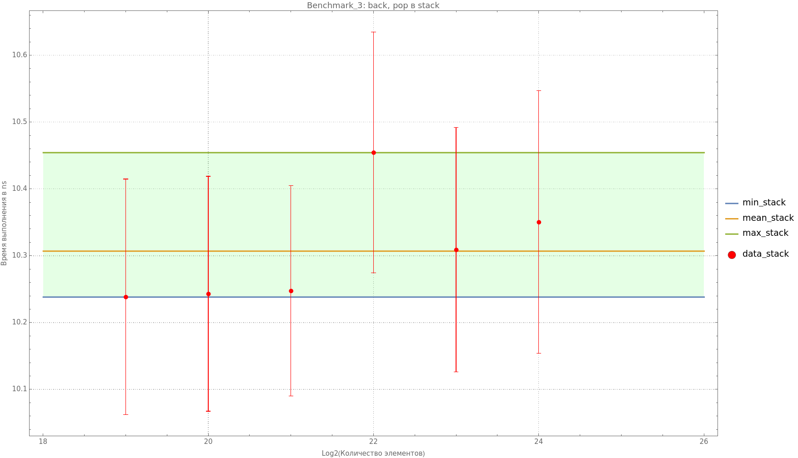 
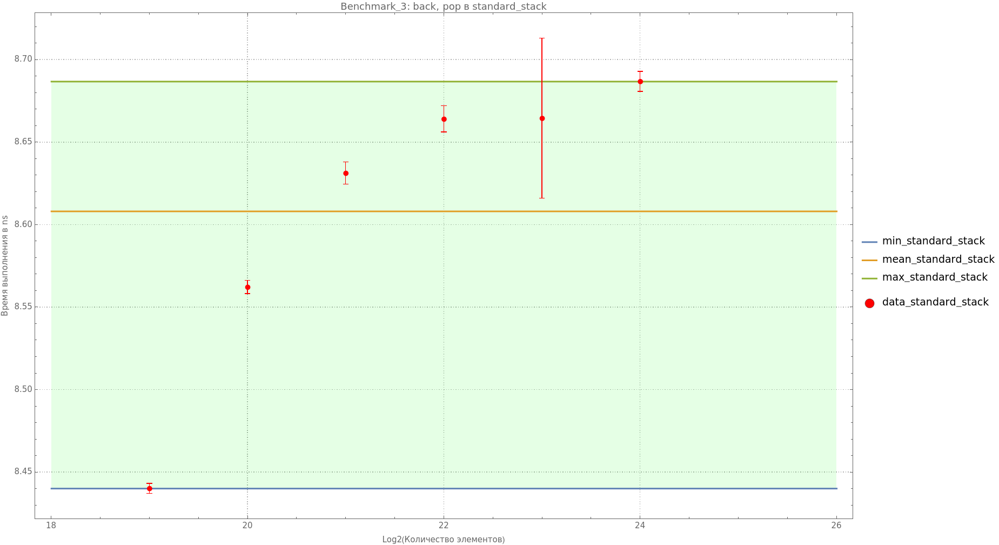
