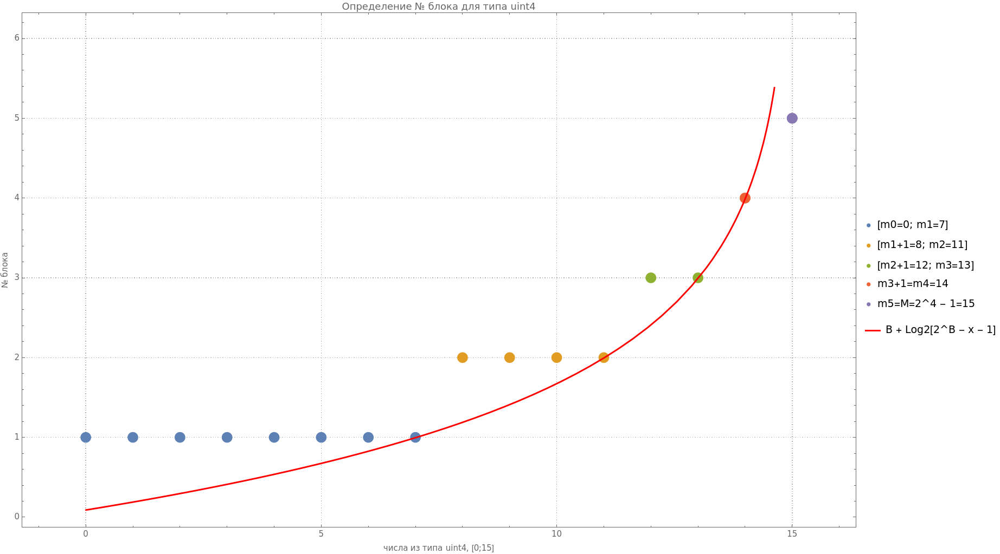

### Предварительные сведенья

Первым делом, давайте уточним формулировку задача из статьи и сделаем ряд оговорок, соглашений. Формулировка задачи из статьи:
>Нужно реализовать стек, хранящий целые числа, в котором дополнительно должна существовать операция max(), возвращающая максимальный элемент за O(1) времени и с использованием O(1) дополнительной памяти (в сравнении со стеком без этой операции).

1. Зафиксируем, что под целыми числами далее мы будем подразумевать безнаковые целые числа. А также введём обозначения `uint4` $`= [0; 2^4-1]`$, `uint16` $`= [0; 2^{16}-1]`$, `unit32` $` = [0;2^{32}-1]`$, `unit64` $`= [0;2^{64} - 1]`$ , .... Таже будем говорить, что число $`x`$ имеет тип `uint4`, ..., `uint64`, если $x$ принадлежит соответственно `uint4`, ..., `uint64`. Никаких иных смыслов в `uint4`, ..., `uint64` мы не будем вкладывать. Решение для знаковых выведем позже из решения для безнаковых.
2. $`O(1)`$, $`O(n)`$, ... поскольку не указано, чем является $`n`$, то исходя из содержания статьи далее мы будем предпологать, что это количество элементов в стеке. Более того каких-то прям строигих формальных определений мы не будем в них вкладовать. Например, при употребление в предложениях фраз "... метод `max()` будет работать за $`O(1)`$" мы будем просто считать, что независимо от того сколько элементов в стеке, мы сможем узнать максимальный элемент стека за некоторое константное время.
Также мы не будем затрагивать амортизационный анализ, хоть и будем использовать, как основу для стека `std::vector` с `push_back` и т. д. 
Я целенаправленно расписываюсь здесь в таком косноязычии, поскольку излишняя формальность для демонстрации результатов будет излишня и может породить разговоры, не относящиеся к теме.  
3. В качестве "основы" для стека, как уже было сказано выше будем использовать `std::vector` с применением метода `reserve(N)`, где `N` будет достаточно большим. Заранее также отметим, что метод `pop`, основанный на `pop_back`, будет возвращать элемент. Конечно, это не особо правильно, но для наших исследований это не будет иметь значения. 

### Одно из решений

Одно из решений, которое сразу приходит на ум, чтобы избавиться от зависимости количества элементов в стеке -- это завести таблицу, элементами которой будут все уникальные значения типа. Например, если у нас `uint3`, то возможные значения в стеке -- числа от $0$ до $7$. Для каждого этого числа заведём счётчик и будем подсчитывать, скольку в стеке каждого элемента, то есть при `push i` будем увеличивать счётчик для числа `i`, а при `pop` будем уменьшать счётчик, элемента полученного из `pop`. Тогда при запросе максимума, нам достаточно пройтись по таблице от $7$ до $0$ и посмотреть на счётчик. 
Таким образом, мы получим $`O(U)`$ по времени и по памяти, где $`U`$ -- количество уникальных значений в типе.

Однако очевидно, что для `uint16`, `uint32`, `uint64` и т. д. количество уникальных значений соответственно равно $`2^{16}`$, $`2^{32}`$, $`2^{64}`$, и вряд ли мы планируем хранить в стеке столько чисел. Лучше будет иметь $`O(n)`$, чем $`O(U)`$. Поэтому давайте рассмотрим более содержательное решение. 

### Основное решение

Зафиксируем рассматриваем тип `uint4`, тогда $`M`$ -- максимально возможное значение для типа равно $`2^4 - 1 = 15`$.
Взглянем на решение из статьи:
```java
public void push(int value) {
    if (top == null) {
        top = new Node(value, null);
        max = value;
    } else if (value <= max) {
        top = new Node(value, top);
    } else { // value > max
        top = new Node(2 * value - max, top);
        max = value;
    }
}
```
Нас интересует последний `else`. Когда мы пытаемся добавить элемент `value` больший текущего максимума, то, чтобы впоследствие суметь востановить старый максимум, мы сохраняем значение в стек `element`
```math
element_{i+1} = 2\cdot value - max_i\qquad(I)
```
и 
```math
max_{i+1} = value\qquad(II)
```
Тогда переполнение возможно, например, если у нас $`max_i = 0`$ и мы добавляем (push) число $`12`$, то согласно формуле $`I`$ мы должны сохранить в стек значение $`2\cdot 12 - 0 = 24 > 15`$.

Давайте выясним при каких значениях $`max_i`$, $`value`$ мы получим самое большое $`element_{i+1}`$. Очевидно, что при $`value = M`$ и $`max_i = 0`$, тогда $`element_{i+1} = 2\cdot M = 30`$. 

Однако, заметим, что у нас будет переполнения при добавление $M$, если мы будем добавлять элементы по порядку. Действительно, на первом шаге добавим 0, на втором шаге 1, и так далее до 15. Тогда мы получим следующую картину:
| max | element | value |
|-----|---------|-------|
| 0   | 0       | 0     |
| 1   | 2       | 1     |
| 2   | 3       | 2     |
| 3   | 4       | 3     |
| 4   | 5       | 4     |
| 5   | 6       | 5     |
| 6   | 7       | 6     |
| 7   | 8       | 7     |
| 8   | 9       | 8     |
| 9   | 10      | 9     |
| 10  | 11      | 10    |
| 11  | 12      | 11    |
| 12  | 13      | 12    |
| 13  | 14      | 13    |
| 14  | 15      | 14    |
| 15  | **16**  | 15    |
| 15  | 15      | 15    |

Последний элеменет можно обрабатывать специальным образом и то только в случае первого вхождения этого числа, поэтому здесь проблем нет. Получается, если при добавление мы будем постепенно увеличивать максимум, то проблем с переполнением нет. Конечно, мы не можем гарантировать, что в стек будут добавлять элементы специальным образом, но мы можем исккуственно "подкручивать" максимум, когда человек пытается при текущем максимуме добавить сразу большое число. Чтобы понимать, когда это необходимо делать, давайте выясним минимальное значение числа, при котором будет происходить переполнение.

Изначально при пустом стеке положим, что максимум равен $`0`$. Обозначим его за $`m_0`$. Тогда, чтобы при добавление значения v не произошло переполнение должно выполняться неравенство:
```math
2\cdot v - m_0 < M \Rightarrow v < \frac{M + m_0}{2} 
\Leftrightarrow  v  < \frac{15}{2}
```
Поскольку мы работаем с целыми числами, то мы должы взять лишь целую часть. (Далее $`[x]`$ -- обозначает целую часть действительного числа $`x`$, $`\lceil x \rceil`$ -- округление $`x`$ до ближайшего целого в большую сторону (ceiling). Если будет необходимо акцинтирование внимание на округление в меньшую сторону, то вместо $`[x]`$ будет использоваться $`\lfloor x \rfloor`$, то есть в данной работе $`\lfloor x \rfloor`$ это лишь другое обозначение для $`[x]`$)
```math
v \le \left[ \frac{15}{2}\right] \Leftrightarrow v \le 7
```
То есть при текущим максимуме равном $`0`$ мы можем добавлять в стек лишь числа из $`[0;7]`$. Пусть теперь текущий максимум равен $`m_1 = 7`$. Тогда, чтобы не было переполнения, должно выполняться неравенство:
```math
v < \frac{M + m_1}{2} \Leftrightarrow v < \frac{M + \frac{M + m_0}{2}}{2}
```
Поскольку мы говорим про типы `uintB`, где `B` количество бит числа типа `uintB`, то $`M = 2^{B} - 1`$ (для `uint4` соответственно $`B =4`$). Тогда неравенство преобразуется в 
```math
    v <  \frac{2^{B} - 1 + \frac{2^B + m_0 - 1}{2}}{2} 
    \Leftrightarrow
    v <  \frac{2^{B+1} + 2^B -1 -2}{2^2}
    \Leftrightarrow  
    v < \frac{32 + 16 - 3}{4}
    \Leftrightarrow
    v < \frac{45}{4}
```
откуда $`v \le \left[ \frac{45}{4}\right]`$, $`v \le 11`$. 

Аналогично, пусть теперь $`m_2 = 11`$, тогда должно выполняться неравенство:
```math
v <  \frac{2^{B} - 1 + \frac{2^B + m_2 - 1}{2}}{2} 
 \Leftrightarrow
  v <  \frac{2^{B+2} + 2^{B+1} + 2^B - 2^3 +1}{2^3}
\Leftrightarrow v < \frac{105}{8}
```
откуда $`v \le \left[ \frac{105}{4}\right]`$, $`v \le 13`$.
Продолжим аналогичным образом:
Положим $`m_3 = 13`$ и повторим расчёт:
```math
m_4 = \left[\frac{15 + 13}{2}\right] = 14
```
```math
m_5 = \left[\frac{15+14}{2}\right] = 14
```
зациклились. Но это опять же не беда, поскольку число $`M`$ мы обрабатываем отдельно.

Таким образом, мы видим, что красивая для $m_n$ формула получается:
```math
m_n =  \left[\frac{2^{B+n-1} + 2^{B+n-2}+ \dots + 2^B - 2^n + 1}{2^n} \right],\quad n\in \mathbb{N}
```
и $`m_0 = 0`$.
Докажем её при помощи математической индукции. 
1. Для $`n=1`$ показали выше.
2. Предположим, что формуля справедлива для $`n=k`$
```math
m_k =  \left[\frac{2^{B+k-1} + 2^{B+k-2}+ \dots + 2^B - 2^k + 1}{2^k} \right],\quad k\in \mathbb{N}
```
и покажем справедливость для $`n=k+1`$. Из неравенств мы знаем, что 
```math
m_{k+1} = \left[\frac{2^B -1 + m_k}{2} \right]
```
воспользуемся предположением для $m_k$ и получим:
```math
\begin{multline}
m_{k+1} = \left[\frac{2^B -1 + \frac{2^{B+k-1} + 2^{B+k-2}+ \dots + 2^B - 2^k + 1}{2^k}}{2} \right]
= \\[10pt] =
 \left[\frac{2^{B+k} - 2^k + 2^{B+k-1} + 2^{B+k-2}+ \dots + 2^B - 2^k + 1 }{2^{k+1}}\right]
 = \\[10pt] =
  \left[\frac{2^{B+k}  + 2^{B+k-1} + 2^{B+k-2}+ \dots + 2^B - 2^{k+1} + 1 }{2^{k+1}}\right]
\end{multline}
```
Что и требовалось доказать. Теперь давайте преобразуем сумму в числителе. Для этого необходимо рассмотреть суммы вида:
```math
2^{B+n-1} + 2^{B+n-2}+ \dots + 2^B = \sum_{i = 1}^{n}\left(2^{B+n-i}\right) = 2^B \cdot \sum_{i = 0}^{n-1}\left(2^{i}\right)
=
2^B \cdot (2^n - 1)
``` 
следовательно получим:
```math
m_n = \left[\frac{2^B \cdot (2^n - 1) - 2^n +1}{2^n} \right]
=\left[\frac{2^B \cdot (2^n - 1) - 2^n}{2^n} + \frac{1}{2^n} \right]
```
Поскольку нас интересуют значение $`m_n`$ при $`n \in [1;B]`$, то:
```math
\frac{2^B \cdot (2^n - 1) - 2^n}{2^n} = 2^{B-n}\cdot (2^n - 1) - 1  \in \mathbb{N}\cup\{0\}
```
```math
\frac{1}{2^n} < 1
```
Тогда по свойствам функции целой части получаем:
```math
m_n = \frac{2^B \cdot (2^n - 1) - 2^n}{2^n}, \quad n \in [1; B]
```
С учётом, того что $`m_0 = 0`$ и число $`M = 2^B - 1`$ мы обрабатываем отдельно, то положив $`m_{B+1} = M`$, мы получаем, что числа $`m_n`$, $`n \in [0; B+1]`$ разбивают все значения типа `uintB` на $`B+1`$ блоков вида:
```math
b_1 = [m_{0}; m_{1}],\ b_1 =[m_{1}+1; m_{2}],\ b_2 = [m_2 + 1; m_3], ... ,\\
b_{B-1}=[m_{B-2}+1;M-2] , b_{B}=[M-1] ,b_{B+1} = [M]
```
Для полноты обоснуем значения для $`b_{B-1}`$
```math
m_{B-1} 
    = 2^{B - B + 1}\cdot \left(2^{B-1} - 1\right) -1 
    = 2^B - 2 - 1 = M - 2 
```
```math
m_{B-2} 
    = 2^{B - B + 2}\cdot \left(2^{B-2} - 1\right) - 1
    = 2^B - 4 - 1 = 2^B - 5 = M - 4
```
поэтому не один из блоков не пустой.

Таким образом, теперь процесс добавления в стек мы можем разбить на два случая:
1. Когда мы добавляем в стек значение `value`, которое принадлежит тому же блоку, что и текущий максимум.
2. Когда мы добавляем в стек значение `value`, которое принадлежит блоку с большим индексом, чем индекс блока текущего максимума.

Случая, когда `value` из блока с меньшим индексом, чем индекс блока текущего максимума, нас не интересует, поскольку мы попадаем во вторую ветку `else` изначального алгоритма добавления ($`value < max`$). 

Тогда, в первом случае мы гарантировано знаем, что у нас не будет переполнения по формуле $`I`$, а значит именно по ней и добавляем элемент в стек.

Во втором же случае мы не можем использовать формулу $`I`$. Однако мы точно знаем, что это будет первый элемент в блоке при добавлении и последний элемент в блоке при извлечении. Более того, этот элемент будет текущим максимумом. То есть, если в блоке не было элементов и мы добавляем в него значение `value`, то в стек мы кладём текущий максимум, а `value` сохраняем в максимум. Когда же мы извлекаем последний элемент в блоке, то возвращаемое значение будет равно текущему максимуму, а элемент, хранящийся в стеке в этот момент, будет являться прошлым максимумом. 

Проиллюстрируем сказанное. Положим в стек (из `uint4`) значения: $`0,3,10,12,15,15, 1`$. Тогда мы получим:
|block_id | max| element | value | |count_1 |count_2 |count_3 |count_4 |count_5 |
|---------|----|---------|-------|-|--------|--------|--------|--------|--------|
| 0       | 0  |  0      | 0     | | 1      | 0      | 0      | 0      | 0      |
| 0       | 3  |  6      | 3     | | 2      | 0      | 0      | 0      | 0      |
| 1       | 10 |  *3*    | 10    | | 2      | 1      | 0      | 0      | 0      |
| 2       | 12 | 10      | 12    | | 2      | 1      | 1      | 0      | 0      |
| 4       | 15 | *12*    | 15    | | 2      | 1      | 1      | 0      | 1      |
| 4       | 15 | 15      | 15    | | 2      | 1      | 1      | 0      | 2      |
| 4       | 15 | 1       | 1     | | 2      | 1      | 1      | 0      | 3      |

`block_id` на единицу меньше, чем номер блока.
1. Мы выполняем `push 0`. Так как текущий максимум равен 0, то $`element = 2\cdot 0 + 0 = 0`$. Текущий максимум имеем `id` равное 0, поэтому количество элементов для блока `1` увеличивается, то есть счётчик `count_1` увеличивается на 1. 
2. `push 3`. $`3`$ также также принадлежит блоку с `id` равным 0, поэтому по формуле $`I`$ кладём `6` и увеличиваем счётчик `count_1`.
3. `push 10`. $`10`$ из блока с большим индексом, поэтому, мы кладём в стек текущий максимум, то есть $`3`$, обновляем максимум на `value`, то есть на $`10`$ и увеличиваем количество элементов для блока 2 на один, то есть `count_2` равно $`1`$.
4. аналогично пункту 3. У нас опять `value = 12` из блока с большим номером, чем текущий максимум. Поэтому повторяем процедуру.
5. аналогично пункту 3 и 4.
6. Первое вхождение числа 15 у нас теперь всегда будет обрабатываться специальным образом. А последнующие успешно обрабатываются другими ветвями `else`. 

Таким образом, `count_i` -- это количество добавленных элементов в стек, при максимуме из `i` блока. Так, например, несмотря на то что $`1`$  из блока №1, в момент её добавления текущий максимум был $`15`$, а значит мы увеличиваем `count_5`.

Когда мы будем выполнять `pop`, то нам необходимо специальным образом обработать лишь случаи, когда перед началом выполнения `pop` счётчик блока с № текущего максимума будет равен $`1`$. 

Так в примере выше выполним первый `pop` после всех `push`. Номер текущего максимум $5$ в счётчике `count_5` значение $`3`$. Значит, извлекаем обычным образом, а именно, если `element` меньше текущего максимума, то значит в стеке хранится настоящее значение и именно его надо вернуть, то есть возвращаем $`1`$ и счётчик `count_5` станет равен $`2`$. 

Извелкаем ещё раз. Поскольку в `count_5` значение $`2`$, то значит где-то раньше было число $`15`$, поэтому в стеке истинное число. Возвращаем $`15`$ и `count_5` равен $`1`$.

Извлекаем ещё раз. Поскольку в `count_5` значение $`1`$, то значит на вершине стека лежит прошлый максимум, а текущий максимум это истинный элемент, который был добавлен. Соответственно возвращаем текущий максимум $`15`$, устанавливаем `count_5` равным $`0`$, а текущий максимум устанавливаем в $`12`$. Далее аналогично.

Таким образом, для реализации нам потребуется `B+1` счётчиков (переменных). Для `uint32` всего `33` переменных, причём от количества элементов в стеке это значение не зависит. (Строго говоря, конечно, зависит, поскольку чем больше элементов в стек мы планируем положить, тем больший тип под счётчики мы должны завести. Но опять же, это уже проблемы из другой серии. Действительно, если вы планируете хранить в стеке больше чем $`2^{32} - 1`$, $`2^{64} - 1`$ элементов, то всегда можно взять счётчики размера $`128`$ бит, и относительно такого огромного количества `uint32` чисел, размеры этих `33` счётчиков будут каплями в море.)

Другим важным моментом является определение номера блока по заданному число $`x`$.  Так, например, когда нам пришло число $`x`$ большее чем текущий максимум, то мы должны правильно определить номер блока этого $`x`$. С одной стороны количество блоков довольно мало и можно попробовать последовательно сравнивать $`x`$ с $`m_n`$ или бинарным поиском. Однако нет ли какой нибудь функции $`f`$, которая по заданному $`x`$ возвращала бы номер блока или, если положить $`g(x) = f(x) - 1`$, то его `id`? Давайте поищем её.

Мы точно знаем, что $`f(m_0) = f(0) = 1`$, $`f(m_n) = n`$, $`n \in [1;B]`$, то есть:
```math
f\left(\frac{2^B\cdot\left(2^n - 1\right) -2^n}{2^n}\right) = n
\Leftrightarrow
f\left(2^{B-n}\cdot\left(2^n - 1\right) - 1 \right) = n
\Leftrightarrow
f\left(2^{B} - 2^{B-n} - 1 \right) = n, \qquad (III)  
```
и $`f(m_{B+1}) = f(M) = B+1`$

Предположим, что нам дано произвольное число $`z`$, тогда должно существовать такое $`k \in [1; B+1]`$, что верно $`z \le m_k`$, то есть верно:
```math
 z \le  2^{B} - 2^{B-k} - 1
```
пусть $`z = x - 1`$, тогда верно 
```math
    x \le 2^{B} - 2^{B-k} \Leftrightarrow x \le 2^B (1 - 2^{-k})
    \Leftrightarrow 
    \frac{x}{2^B} \le 1 - 2^{-k} \Leftrightarrow
    2^{-k} \le 1 - \frac{x}{2^B} 
```
Так как $`x \le 2^B - 1`$, то  $`\frac{x}{2^B} < 1`$, а в силу $`\log_a(f(x))  \le \log_a(g(x)) \iff f(x) \le g(x)`$ при $`a>1`$, то 
```math
2^{-k} \le 1 - \frac{x}{2^B}  \iff \log_2\left(2^{-k}\right) \le \log_2\left(1 - \frac{x}{2^B}\right) 
\Leftrightarrow -k  \le B - \log_2\left(2^B - x\right) 
```
Таким образом, для любого $`z = x - 1`$, должен существовать $`k \in [1; B+1]`$, такой что:
```math
k \ge B - \log_2\left(2^B - x\right) 
```
Если потребовать $`z \in [0; 2^B - 2]`$, тогда $`x \in  [0; 2^B - 1]`$ и тогда можно записать:
```math
k \ge B - \log_2\left(2^B - z - 1\right) 
```
Тогда, например, при $`z = 0`$ и $`B = 4`$, мы получим:
```math
k \ge 4 - \log_2\Big{(}2^4  - 1\Big{)} \Rightarrow k \ge 4 - 3.80735...
```
А хотим получить $`1`$ (для индекса $`0`$), что в целом довольно близко. Поэтому давайте попробуем округлить результат от $`\log_2`$ и положить это, как $`f(x)`$ 

Предположим, что 
```math
    f(x) = \lceil -\log_2 \left(2^B - x -1\right)\rceil  + B
= B - \lfloor \log_2(2^B - x - 1)\rfloor,\quad x \in [0; 2^B - 2], \quad (IV)
```
проверим, что для этого $`f`$ верно $`III`$:
1. для $`m_0 = 0`$: $`f(0) = B - \left[\log2\left(15\right)\right] = 4 - 3 = 1`$
2. для $`m_n`$, $`n \in [1;B] = B - \left[\log2\left(2^B - 2^B + 2^{B-n} + 1 -1 \right)\right] = B - B  + n = n`$
3. для $`m_{B+1} = 2^B - 1 = M - 1`$, положим отдельно $`f(M-1) = B+1`$

То есть свойству $`III`$ наше определение удовлетворяет. 

Осталось проверить для произвольного числа. Рассмотрим сначало интервал $`I_1 = (m_0; m_1) = (0; m_1)`$. Пусть $`x_1 \in I_1`$, тогда покажем, что $`f(x_1) = 1`$. Раз $`x_1 \in I_1`$, то справедливо:
```math
    0 < x_1 < m_1 \Leftrightarrow 0 <  x_1 < 2^{B-1} - 1
```
Функция $f(x)$ является неубывающим при $`x \in [0; 2^B - 2]`$. Действительно, при увеличение $`x`$ мы уменьшаем аргумент монотонно возростающей функции $`\log_2`$, а взятие целой части является неубывающей функцией.

Тогда по определению неубывающей функции для любых $`x, y, z \in [0; 2^B - 2]`$, таких что $`x < y < z`$ будет справедливо, что $`f(x) \le f(y) \le f(z)`$. Пусть $`x = 0`$, $`y = x_1`$, a $`z = m_1`$, поскольку $`f(x) = f(0) = 1`$, то и $`f(y) \ge 1`$, а раз $`f(z) = f(m_1) = 1`$, то справедливо $`f(y) \le 1`$. Таким образом, мы имеем $`1 \le f(y) \le 1`$, а поскольку $`f(y) \in \mathbb{N}`$, то можно заключить, что $`f(y) = f(x_1) = 1`$.  

Почти аналогично давайте докажем другие случаи. Однако перед этим нам потребуется доказать, что для любого $`x = m_n + 1`$, $`n \in [1, B-1]`$ справедливо $`f(x) = n + 1`$, то есть:
```math
f\left(2^{B} - 2^{B-n} - 1  + 1\right) = n + 1
```
Действительно:
```math
\begin{multline}
f\left(2^{B} - 2^{B-n} \right)  = B  - \lfloor \log_2(2^B - 2^{B} + 2^{B-n} - 1)\rfloor =  B  - \lfloor \log_2(2^{B-n} - 1)\rfloor 
= \\[10pt] =
B  - \left[ \log_2 \left(2^{B-n} \cdot\left(1 - \frac{1}{2^{B-n}}\right)\right)\right] = B - B + n - \left[ \log_2 \left(1 - \frac{1}{2^{B-n}} \right)\right]
= \\[10pt] =
n - \left[ \log_2 \left(1 - \frac{1}{2^{B-n}} \right) \right]
\end{multline}
```
Рассмотрим $`p(x) = \log_2 \left(1 - \frac{1}{2^{x}} \right)`$ для $`x \in \mathbb{R}`$, $`x > 0`$. Тогда:
```math
p'(x) = \frac{2^{-x}}{1 - 2^{-x}}
```
причём при $x > 0$, $p'(x) > 0$, а значит $`p(x)`$ монотонно возростает. Следовательно при возможных $`n \in [1; B-1]`$ минимальное значение $`\log_2 \left(1 - \frac{1}{2^{B-n}} \right)`$ будет при $`n = B - 1`$, когда $`x = B-n`$ будет минимальным, а максимальное значение будет при $`n = 1`$. Вычислим минимум:
```math
\log_2 \left(1 - \frac{1}{2^{B-B+1}} \right)= -1
```
А также покажем, что максимум будет меньше нуля:
```math
\log_2 \left(1 - \frac{1}{2^{B-1}} \right) < 0 \Leftrightarrow
1 - \frac{1}{2^{B-1}} < 1  \Leftrightarrow
 \frac{1}{2^{B-1}}  > 0
```
Таким образом, для любого $`n\in[1;B-1]`$ мы имеем:
```math
-1 \le \log_2 \left(1 - \frac{1}{2^{B-n}} \right) < 0
```
Ну тогда для любого $`n \in [1; B-1]`$ мы получим, что
```math
\left[ \log_2 \left(1 - \frac{1}{2^{B-n}} \right) \right] = -1
```
А значит для любого $`n \in [1; B-1]`$:
```math
f(m_n +1) = f\left(2^{B} - 2^{B-n} \right)  = n - \left[ \log_2 \left(1 - \frac{1}{2^{B-n}} \right) \right]= n - (-1) = n + 1
```
Что и требовалось доказать.

Теперь перейдём к доказательству корректности $`f(x)`$ для других интервалов.
Рассмотрим произвольный интервал  $`I_i = (m_{i-1} + 1; m_i)$, $i \in [2; B-1]`$ (нет смысла рассматривать для $`i = B`$, поскольку в блоке с номером $`B`$ всего одно число $`2^B-2`$, см. устройство блоков.). Пусть $`x_i \in I_i`$, тогда покажем, что $`f(x_i) = i`$

Аналогично как и дляслучая $`I_i`$, поскольку по определению неубывающей функции для любых $`x, y, z \in [0; 2^B - 2]`$, таких что $`x < y < z`$ будет справедливо, что $`f(x) \le f(y) \le f(z)`$. Пусть $`x = m_{i-1}+1`$, $`y = x_i`$, a $`z = m_i`$, поскольку выше мы доказали, что $`f(m_{i-1}+1) = i -1 + 1 = i`$, то и $`f(y) \ge i`$, а раз $`f(z) = f(m_i) = i`$, то справедливо $`f(y) \le 1`$. Таким образом, мы имеем $`i \le f(y) \le i`$, а поскольку $`f(y) \in \mathbb{N}`$, то можно заключить, что $`f(y) = f(x_i) = i`$.

Таким образом, формула (IV) действительно справедлива для произвольного числа $`x \in [0; 2^B - 2]`$, то есть тепреь для любого возможно числа $`x \in [0; 2^B - 1]`$ мы быстро и легко можем определить какому блоку оно принадлежит (см. пример для `uint4` на изображение ниже). 


Это значит, что мы готовы переходить к написанию [кода](code.md).
